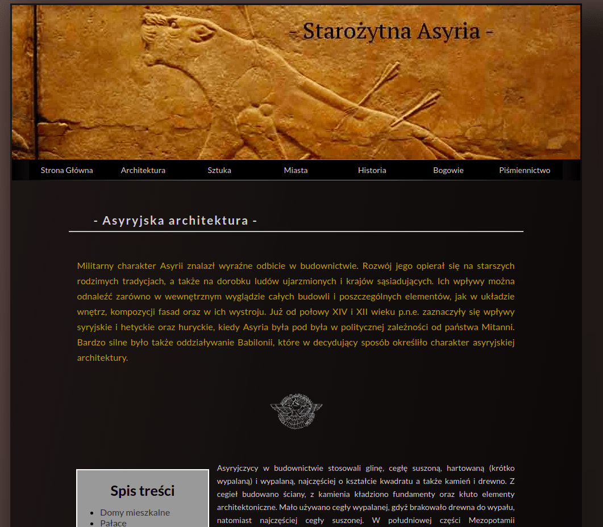

# Starożytna Asyria
Starożytna Asyria is RWD website with articles about Ancient Assyria's culture, history and art.

# Technologies
JavaScript, CSS, Sass (Scss), HTML, Jest

# Supported Platforms
Google Chrome - version 73.0.3683.103 and higher  
Mozilla Firefox - version 66.0.3 and higher  
Opera - version 58.0.3135.132 and higher  
Chromium - version 71.0.3578.98 and higher  
Edge  
Yandex  

# Supported Controllers
Mouse

# Compiling Sass to CSS
Dart Sass npm package is using for compiling Sass to CSS: [https://www.npmjs.com/package/node-sass](https://www.npmjs.com/package/node-sass).
To compile in this project use: `sass --watch scss:css`

# Unit tests
The project has tests created with Jest. To run them use `npx jest` or `npm run test`

# Open website
[http://www.mat-assur.edu.pl](http://www.mat-assur.edu.pl)
